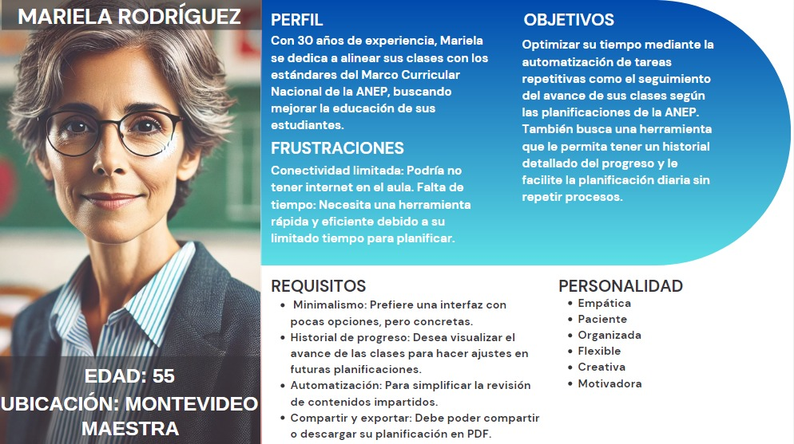
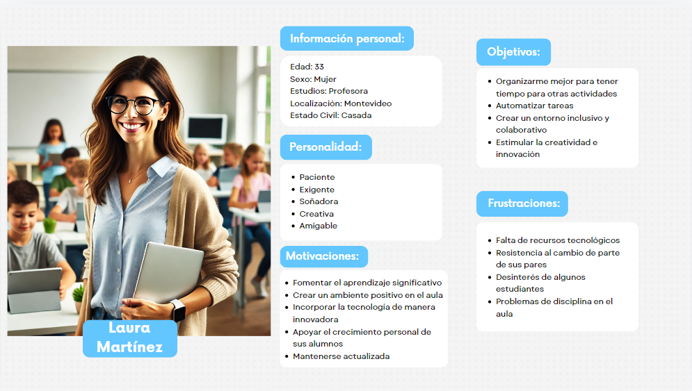
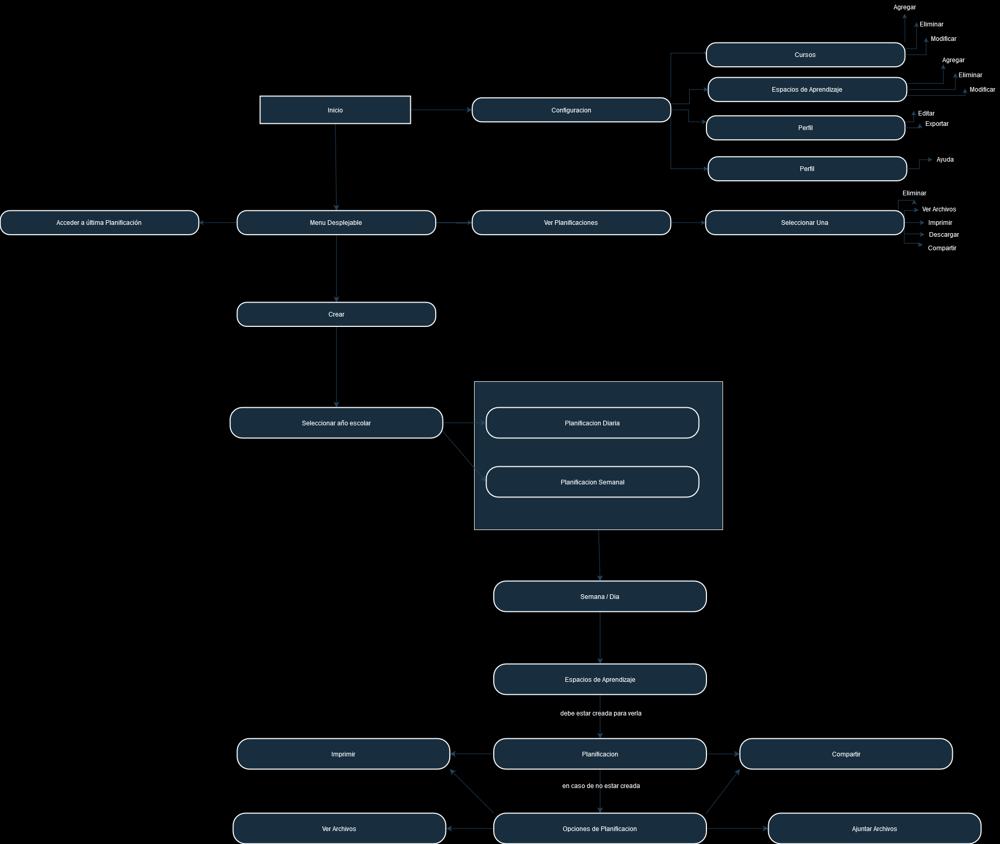

# Informe académico (entrega 1)

## Repositorio Git

### Repositorios locales y remotos

Para desarrollar colaborativamente el proyecto en nuestro equipo, compuesto de tres miembros, hemos utilizado el repositorio Git proporcionado por el curso. Trabajamos con una composición local y remota y una estructuración en ramas para un manejo eficaz y ordenado de los cambios. En cuanto a la estructura de trabajo, al inicio del proyecto se crearon las ramas desde master, basadas en los ítems diferentes del proyecto asignados a cada uno. Por ende, cada integrante accede a la rama que le corresponde y realiza modificaciones y avances, en nuestra composición garantizamos que todos estos cambios estén debidamente estructurados y versionados. A continuación, se expone el flujo de trabajo del equipo:

- Acceso a las ramas: desde un principio, cada uno de los integrantes tiene acceso a las ramas ya creadas, lo que permite a cada tarea ser independiente, de esta manera, no interfere con la rama principal o main. Cada rama se puede complementar, añadir los nuevos cambios y continuar su desarrollo.

- Desarrollo en local: los cambios o modificaciones que se realizan en los proyectos en el entorno local de cada integrante, puede probar y verificar, si sus contribuciones son correctas o no, antes de sincronizar con el repositorio remoto.

- Commits y sincronización: se realizan commits regulares en las ramas en los locales, y de forma posterior se sincronizan con el repositorio remoto, donde los demás integrantes pueden verificar nuestro avance y aportar feedback si fuese necesario.

- Fusión de rama principal: una vez que se completan y revisan las modificaciones a una rama, la rama activa se fusiona con las ramas principales, lo que garantiza que la tarea final esté disponible de manera estable y siempre actualizada.

Este flujo de trabajo, basado en ramificaciones desde el inicio del proyecto, permitió mantener la continuidad del proceso, permitiéndonos colaborar sin interrumpir el desarrollo de otros, hasta que el cambio estuvo listo para la integración.

### Aplicación de comandos Git

Los comandos de Git que utilizamos a lo largo del desarollo del informe fueron:

- git clone
- code .
- git add .
- git commit -m
- git push
- git pull
- git switch
- git branch
- git log --oneline --graph
- git checkout

## Versionado

### Buenas prácticas de versionado

En nuestro proyecto, hemos adoptado un enfoque consciente para la gestión de los commits, priorizando la claridad y la comunicación. Optamos por realizar commits cortos y explicativos que reflejan de manera precisa los cambios que implementamos. Cada uno de estos commits se hace en la rama correspondiente, lo que ayuda a mantener nuestro historial de cambios ordenado y fácil de seguir.

Además, hemos establecido la práctica de commits diarios. Esto significa que no dudamos en realizar varios commits para una misma tarea, si es necesario. De esta manera, podemos documentar cada paso del progreso y asegurar que se registren todos los detalles relevantes. No solo mejora la trazabilidad de las modificaciones, sino que también fomenta un ambiente colaborativo dentro del equipo.

Antes de mergear a la rama principal (main), nos aseguramos de conversar como equipo sobre los cambios realizados. Este diálogo es fundamental, ya que permite que todos estén al tanto de las modificaciones y se sientan cómodos con lo que se ha hecho. Cuando finalmente realizamos el merge, trasladamos todos los commits a main, lo que nos permite ver claramente el trabajo realizado a lo largo del tiempo. Así, cada uno de nosotros puede apreciar el esfuerzo conjunto y el progreso del proyecto de manera tangible.

### Evolución del proyecto

El desarrollo del proyecto comenzó con una fase de investigación enfocada en los programas y planes de la ANEP, con el objetivo de comprender las normativas y los requerimientos que deben seguir los docentes en su planificación educativa. Esta investigación inicial nos permitió diseñar una entrevista más precisa para una maestra en activo.

Uno de los integrantes del equipo, cuya madre es maestra, se encargó de realizar la entrevista, obteniendo valiosa información sobre las dificultades y necesidades reales de los docentes al gestionar sus planificaciones. A partir de las respuestas obtenidas, comenzamos a construir el proyecto paso a paso.

Primero, estructuramos el código del proyecto utilizando Git para controlar versiones, creando diferentes ramas para cada parte del desarrollo. Esto nos permitió trabajar de forma organizada, y a la vez, documentamos este proceso en la sección de "Buenas prácticas de versionado", explicando cómo gestionamos los commits y los merges a la rama principal.

Posteriormente, fuimos documentando las respuestas de la entrevista y utilizándolas para diseñar un modelo conceptual de la aplicación. A partir de este modelo, desarrollamos los primeros bocetos de la interfaz de usuario.

Con estos bocetos y la información recopilada, creamos las historias de usuario y los casos de uso. Finalmente, con todo esto, fuimos capaces de establecer tanto las restricciones funcionales como no funcionales, asegurando que la aplicación responda a las necesidades de los docentes.

## Elicitación

### Evidencia de actividades de investigación

Nuestra investigacion se contruyo a través de la revisión de documentos bridados de la ANEP hacia los docentes y entrevistas con docentes. Se vio claramente que el impacto de herramientas tecnológicas en la planificación, estas formarian parte de soluciones significativas hacia el problema que se nos dio ya que estas permiten la posibilidad de ajustar los planes de estudio a lo largo del día, cambiar cómo se presentan los conocimientos, además de incluir un sistema que pueda hacer seguimiento del progreso en relación a los perfiles de egreso definidos por la ANEP​.

En el caso de la entrevista, realizamos una sola a una maestra de primaria, madre de uno de los integrantes del equipo su nombre es Mariela Caceres, ella es maestra de sexto año en el colegio Adventista del Prado Montevideo, su edad es 55 años, vive en Paso Molino Montevideo, basandonos en el proyecto su manejo de la tecnologia es bueno, utliza diariamente dispositivos moviles IOS y computadoras Windows. El contexto en el que se realizo la entrevista fue en la casa de ella.

Para explicar mejor en lo que se baso nuestra investigacion dividiremos esto en varias partes, con el fin que se vea el problema al que nos enfrentamos y como llegariamos a una solucion. Esto se basa en la entrevista realizada y en los documentos brindados por la ANEP.

#### Contexto y Problemática

El sistema de educación pública de Uruguay, regido por la ANEP, ha introducido un marco curricular que pone especial énfasis en las competencias generales y específicas que los estudiantes deben desarrollar a lo largo de su educación. Estas competencias son clave en la planificación de los docentes, quienes deben alinearse con ellas a lo largo del ciclo lectivo. Según la Entrevista a la Maestra, uno de los mayores desafíos es vincular los contenidos impartidos en clase con estas competencias, además de adaptar las planificaciones a los cambios imprevistos, como actividades de grupo o dificultades individuales de los alumnos.

#### Planificación y Competencias

La planificación semanal y diaria, como describe la docente, se basa en los contenidos programáticos establecidos por la ANEP. La planificación semanal abarca materias generales ("Matemática"), mientras que la diaria es más específica ("Números primos"). Estos planes deben ajustarse constantemente a las competencias generales, como pensamiento crítico y comunicación, que se derivan del Marco Curricular Nacional (MCN) de la ANEP. Estas competencias, 10 en total, son transversales y fundamentales para todos los niveles educativos.

#### Retos Identificados

En la entrevista, la docente resalta varios problemas en la planificación:

- Relacionar contenidos con competencias específicas, lo que a menudo se percibe como complicado. Esto refleja la necesidad de herramientas que automaticen este proceso, sugiriendo competencias basadas en el contenido a impartir.
- Flexibilidad en la planificación diaria, dado que los temas a menudo deben reprogramarse.
- Incorporación de aprendizajes diferenciados, ya que algunos alumnos requieren adaptaciones en los contenidos para asegurar su inclusión en el proceso de enseñanza.

#### Propuesta de Sistema

La necesidad de un sistema surge a partir de las dificultades actuales. Un sistema automatizado debería ofrecer:

- Almacenamiento y tracking de contenidos impartidos, alineándolos con el perfil de egreso del estudiante.
- Flexibilidad en la planificación diaria, permitiendo mover contenidos o actividades a días posteriores cuando sea necesario.
- Accesibilidad y colaboración, permitiendo planificar desde cualquier dispositivo y compartir la información con otros docentes del mismo nivel educativo​(Transformación Educativa | Aprender más)​(Transformación Educativa | Aprender más).

Este sistema facilitaría la alineación entre las planificaciones de los docentes y los criterios de logro y competencias específicas definidos por la ANEP, ayudando a los maestros a gestionar mejor el tiempo y adaptarse a las necesidades de sus alumnos.

### Referencias a fuentes de información

Como comentabamos anteriormente las fuentes de nuestro proyecto incluyen tanto la documentacion brindada por la anep hacia los docentes, como la que nos brindo nuestra entrevista y allegados.

#### Links de la ANEP

- [Programas de Educación Básica Integrada](https://www.anep.edu.uy/programas-ebi-2023-2023)
- [Marco Curricular Nacional](https://www.anep.edu.uy/15-d-transformaci-n-educativa/marco-curricular-nacional)
- [Competencias / Perfiles de Egreso](https://transformacioneducativa.anep.edu.uy/transformacion-curricular/perfiles-egreso-competencias#perfiles)
- [Marco Nacional](https://transformacioneducativa.anep.edu.uy/transformacion-curricular/mcn)

#### Link Entrevista

- [Ver la Entrevista aqui](/docs/informe1_extra/preguntas%20entrevista.md)

#### Ejemplos de Planificaciones.

    
    
     Estandar" width="400">
     Reprogramada" width="400">

Imagenes de las planificaciones de Mariela Caceres.

### Caracterización de usuarios

#### User Mariela Rodriguez

- En concreto, le gustarían que la aplicación:

  - Les permita agrupar planificaciones por salones, ya que en ocasiones maneja más de un grupo o clase, lo que exige un control más específico de cada uno.
  - Ofrezca una manera clara de visualizar el historial de progreso de sus clases, para ver tanto el avance diario como una vista general de cómo está evolucionando el curso a lo largo del tiempo [esto le permitiría ver el estado general de las clases y no repetir tareas, algo que actualmente le toma mucho tiempo y se vuelve repetitivo].

- Requisitos clave para la aplicación:

  - Mariella valora la simplicidad. Quiere una aplicación con pocas opciones, pero que estas sean concretas y enfocadas en las funciones que realmente necesita. Entre las funcionalidades más importantes que requiere están:

  - Automatización del seguimiento del progreso respecto a los contenidos de la ANEP.
  - Opciones para compartir y exportar planificaciones en formato PDF, ya que esto le facilita revisar, ajustar y compartir sus planes con otros docentes o coordinadores.
  - Flexibilidad para mover actividades o contenido entre días, en caso de que no se haya podido cubrir un tema en una clase, algo que ocurre con frecuencia.

- Desafíos o problemas potenciales:

  - Conectividad limitada: Durante sus clases, es posible que Mariella no siempre tenga acceso a internet, por lo que la aplicación debería poder funcionar en modo offline o tener opciones para que ella pueda consultar su planificación sin conexión.
  - Tiempo limitado: Con poco tiempo disponible para planificar después de la jornada escolar, es importante que la herramienta le permita organizar su día de manera eficiente y rápida.

En resumen, Mariella y Laura necesitan una aplicación minimalista y fácil de usar, que le permita automatizar tareas repetitivas y controlar el progreso de sus clases de manera efectiva. Esto, junto con la opción de agrupar planificaciones por salón, le facilitará su trabajo diario y le ayudará a cumplir con los estándares de la ANEP sin consumir demasiado tiempo en la gestión manual de sus planes

### Modelo conceptual del problema

#### Glosario / Explicacion

- Inicio:
  Al abrir la aplicación, la pantalla principal ofrece acceso a las funciones básicas como Configuración y un Menú.

- Configuración:
  Accesible desde el incio, la sección de Configuración permite al usuario editar su foto de perfil e información personal. Aquí, el docente crea cursos y espacios de aprendizaje para posteriormente usarlos en las planificaciones.

- Menú:
  Accesible desde el inicio el Menú despliega varias opciones clave para la gestión de planificaciones:

      - Acceder a última Planificación: Permite al usuario reanudar rápidamente la planificación más reciente.

      - Ver Planificaciónes: Se selecciona una de las planificaciones ya creadas y se pueden ver archivos adjuntos, compartirla, descargarla, editarla y ademas ofrece la opción eliminarla.

      - Crear
          - Paso 1) Seleccionar Curso: Despliega un submenú para elegir el año escolar
          - Paso 2) Seleccionar Planificacion: se elige las opciones de Planificación Diaria o Planificación Semanal.
          - Paso 4) Se crea la planificacion:

              - Se elige Planificación Diaria / Planificación Semanal: Despliega un calendario donde el usuario puede seleccionar un día/semana específico para crear la planificación diaria/semanal.
              - Se elige los espacios de aprendizaje previamente cargados.
              - Se cargan los archivos adjuntos que se desee
              - Se crea, luego se puede descargarla, compartirla y imprimrla en formato PDF

## Especificación

### Requerimientos funcionales y no funcionales

#### Restricciones Funcionales (RF):

- Gestión de archivos y compartición: Los usuarios deben poder adjuntar archivos multimedia (los archivos aceptados son: pdf, .docx, .txt, pptx, .jpg , .png) a las planificaciones, compartir, descargar y exportar en PDF, además de imprimir
- Cada planificación se tiene que poder modificar siempre que el usuario lo desee.
- Notificaciones y Recordatorios: El sistema debe permitir configurar notificaciones para recordar eventos importantes como fechas clave o planificaciones pendientes.
- Gestión de Usuarios: La aplicación debe permitir que los usuarios gestionen diferentes perfiles de clases o salones, con la capacidad de organizar planificaciones por clase o grupo de alumnos.
- El sistema debe permitir la integración con calendarios externos, para sincronizar planificaciones con herramientas como Google Calendar.

#### Restricciones No Funcionales (RNF):

- Portabilidad: El sistema debe poder usarse desde un celular, tanto para planificar como para revisar las planificaciones ya hechas.
- Accesibilidad: El sistema debe poder usarse sin conexión a internet.
- El sistema debe poder guardar de manera local las planificaciones.
- Rendimiento: El sistema debe cargar o actualizar rápidamente el contenido cargado para obtener una respuesta fluida y eficaz en el momento.
- Seguridad de la Información: El sistema debe garantizar que toda la información de los usuarios, incluyendo planificaciones y datos personales, esté protegida mediante mecanismos de encriptación y almacenamiento seguro

### User stories

#### User story 1

Título: Caso de planificación  
Como: maestra de escuela  
Quiero: mejorar y optimizar mi planificación  
Para: facilitar mi organización, aprovechar mejor el tiempo y tener un control más efectivo sobre mis clases

Criterios de aceptación:

- La planificación debe dividirse en los 5 días de la semana.
- La planificación es obligatoria para todo periodo de clases.
- Debo poder acceder y modificar las planificaciones diarias y semanales en cualquier momento.
- La herramienta debe permitirme ver el progreso de la planificación y hacer ajustes según sea necesario.

#### User story 2

Título: Caso de competencia  
Como: maestra de escuela  
Quiero: realizar de forma adecuada una competencia  
Para: poder evaluar a mis alumnos

Criterios de aceptación:

- Las competencias deben estar alineadas con los temas previamente dados y reflejar las competencias requeridas por el programa de la ANEP.
- La herramienta debe permitir establecer criterios de logro para cada competencia.
- Debo poder hacer seguimiento del rendimiento de los alumnos a lo largo del curso, basado en estas competencias.
- Las competencias deben estar vinculadas a las planificaciones diarias y semanale

### Use cases

#### Use case 1: Crear una planificación semanal

| Actor: maestra de escuela |
| ------------------------- |

| **Acción de los actores**                         | **Respuesta del sistema**                                                                                                                                                                   |
| :------------------------------------------------ | :------------------------------------------------------------------------------------------------------------------------------------------------------------------------------------------ |
| 1. Desde el inicio accedemos al icono de opciones | 2. Se muestran las opciones del menú                                                                                                                                                        |
| 3. Seleccionamos un curso                         | 4. Se muestran los años escolares posibles a seleccionar                                                                                                                                    |
| 5. Seleccionamos el año escolar                   | 6. Se muestran las opciones de planificación diaria o semanal                                                                                                                               |
| 7. Seleccionamos planificación semanal            | 8. Se muestra un calendario marcando las semanas del mes actual                                                                                                                             |
| 9. Se selecciona la semana del mes                | 10. Se muestran los bloques creados (en caso de haber creado uno antes)                                                                                                                     |
| 11. Se selecciona agregar bloque                  | 12. Se abre una nueva pestaña y en esta se muestra los espacios y unidades de aprendizaje disponibles, un bloque donde agregar texto de la planificacion y una opcion para agregar archivos |
| 13. Se seleccionan agregar bloque                 | 14. Se vuelve a la pestaña anterior                                                                                                                                                         |

| **Cursos alternativos**                                                                                                |
| :--------------------------------------------------------------------------------------------------------------------- |
| 9.1: El usuario podría acceder mediante un calendario a las semanas de meses posteriores al actual                     |
| 14.1: Luego de registrar los datos de al menos un bloque el usuario podrá imprimir o compartir la planificación creada |

#### Use case 2 : Ver Planificacion:

| Actor: maestra de escuela |
| ------------------------- |

| **Acción de los actores**              | **Respuesta del sistema**                                 |
| :------------------------------------- | :-------------------------------------------------------- |
| 1. Despliego el menu                   | 2. Se muestran las opciones del menú                      |
| 3. Selecciono ver planificaciones      | 4. Se muestran la lista de planificaciones disponibles    |
| 5. Selecciono la planificacion deseada | 6. Se muestra los bloques disponibles de la planificación |

| **Cursos alternativos**                                                                                                       |
| :---------------------------------------------------------------------------------------------------------------------------- |
| 6.1: Luego puedo seleccionar ver (el bloque seleccionado) puedo ver archivos adjuntos y planificacion referida a dicho bloque |

### Bocetos de IU

#### Inicio

#### Inicio -> Configuracion

#### Inicio -> Menu -> Crear Planificación

#### Inicio -> Menu -> Ver / Editar / Eliminar Planificación

## Checkpoint obligatorio 1

Incluir un resumen del avance en elicitación y especificación de requerimientos
Se evaluará de acuerdo al grado de avance

## Validación y verificación

### Verificación

| N.º  | Requerimiento                                                                                                                                                               | Ambigüedad | Completitud | Factibilidad | Verificabilidad | Comentarios                                                                                                      |
| :--: | --------------------------------------------------------------------------------------------------------------------------------------------------------------------------- | :--------: | :---------: | :----------: | :-------------: | ---------------------------------------------------------------------------------------------------------------- |
| RF1  | Gestión de archivos y compartición: Los usuarios deben poder adjuntar archivos multimedia a las planificaciones, compartir, descargar y exportar en PDF, además de imprimir |     No     |     Sí      |      Sí      |       Sí        | Este requerimiento combina la funcionalidad de adjuntar y compartir archivos, mejorando la concisión.            |
| RF2  | Cada planificación se debe poder modificar siempre que el usuario lo desee                                                                                                  |     No     |     Sí      |      Sí      |       Sí        | El requerimiento es claro, pero se deben definir mejor los límites de modificación (e.g., permisos de usuarios). |
| RF3  | El sistema debe permitir configurar notificaciones y recordatorios para eventos importantes                                                                                 |     No     |     Sí      |      Sí      |       Sí        | Verificable al configurar y probar notificaciones en eventos.                                                    |
| RF4  | Los usuarios deben poder gestionar diferentes perfiles de clases o salones, organizando planificaciones por clase o grupo de alumnos                                        |     No     |     Sí      |      Sí      |       Sí        | Verificable mediante la creación de múltiples perfiles y organización por clases.                                |
| RF5  | Nueva restricción: El sistema debe permitir la integración con calendarios externos, para sincronizar planificaciones con herramientas como Google Calendar.                |     No     |     Sí      |      Sí      |       Sí        | Añadida para facilitar la integración de la planificación con herramientas de uso común para docentes.           |
| RNF1 | Portabilidad: El sistema debe usarse desde un celular tanto para planificar como para revisar planificaciones                                                               |     No     |     Sí      |      Sí      |       Sí        | Verificable mediante pruebas en diferentes dispositivos móviles.                                                 |
| RNF2 | Accesibilidad: El sistema debe funcionar sin conexión a internet                                                                                                            |     No     |     Sí      |      Sí      |       Sí        | Debe probarse en modo offline para verificar que todas las funciones esenciales operan sin conexión.             |
| RNF3 | El sistema debe guardar localmente las planificaciones                                                                                                                      |     No     |     Sí      |      Sí      |       Sí        | Verificable comprobando el almacenamiento local en dispositivos sin conexión.                                    |
| RNF4 | Rendimiento: El sistema debe cargar o actualizar rápidamente el contenido                                                                                                   |     No     |     Sí      |      Sí      |       Sí        | El rendimiento se evaluará con pruebas de tiempos de respuesta bajo diferentes condiciones de carga.             |
| RNF5 | Seguridad de la Información: El sistema debe garantizar la protección de los datos mediante encriptación                                                                    |     No     |     Sí      |      Sí      |       Sí        | Verificable mediante auditorías de seguridad y pruebas de encriptación en almacenamiento y transmisión.          |

#### Cambios en Restricciones:

- Se unieron las funcionalidades de gestión de archivos y compartición, ya que ambas cubrían aspectos similares de la aplicación. Esto mejora la claridad y evita redundancia.
- Nueva RF : Se añadió una restricción funcional para la integración con calendarios externos (como Google Calendar), que facilitaría la sincronización de las planificaciones con herramientas comunes para los docentes.

### Validación

- Es incorrecto ver los espacios de aprendizaje como algo que se agrega, elimina y modifica, estos son fijos y dados por la ANEP. Para solucionar esto los espacios y unidades de aprendizaje ya vienen pre cargados en el sistema.

Los espacios y unidades son estos:

- En el segundo paso al crear la planificación, en lugar de seleccionar un año se debe seleccionar un grupo creado.

Para ello pasamos de esto:

A esto:

- La planificación se debe poder dividir en bloques, cada uno con su espacio y unidad curriculares, dentro de estos se escribirá la planificación y se adjuntaran archivos.

Para ello pasamos de esto:

A esto :

- En la configuracion es poco claro que hacen las opciones de editar y exportar perfil. Para ello lo que hicimos fue sacar la opcion de editar ya que a medidas de este problema no es necesario poder editar la foto de perfil y etc, y dejar solo el exportar perfil que lo que hace es exportar cursos, con sus planificaciones en formato PDF.

## Reflexión

### Detalle del trabajo individual

| Alumno          | Fecha        | Actividad                                                                                                                          | Cantidad de horas |
| --------------- | ------------ | ---------------------------------------------------------------------------------------------------------------------------------- | ----------------- |
| Nicolas Machin  | 3/10         | Trabajo en equipo - elicitación                                                                                                    | 4                 |
| Nicolas Bidenti | 3/10         | Trabajo en equipo - elicitación                                                                                                    | 4                 |
| Martin Pereira  | 3/10         | Trabajo en equipo - elicitación                                                                                                    | 4                 |
| Nicolas Bidenti | 4/10         | Rectificando bocetos IU                                                                                                            | 2                 |
| Nicolas Bidenti | 4/10         | Trabajo en equipo - Requerimientos                                                                                                 | 1                 |
| Nicolas Machin  | 4/10         | Trabajo en equipo - Requerimientos                                                                                                 | 1                 |
| Martin Pereira  | 4/10         | Trabajo en equipo - Requerimientos                                                                                                 | 1                 |
| Nicolas Bidenti | 14/9 -> 22/9 | Trabajando en parte de Repositorio de git                                                                                          | 4                 |
| Nicolas Bidenti | 3/10         | Modificando parte de versionado                                                                                                    | 1                 |
| Martin Pereira  | 17/9         | Se agregaron 4 preguntas a las preguntas para la entrevista (Media hora) + Se realizo una entrevista (la entrevista duro una hora) | 1,5               |
| Martin Pereira  | 18/9         | Se realizo una segunda entrevista (la misma fue de media hora)                                                                     | 0,5               |
| Martin Pereira  | 19/9         | Se realizo una tercera entrevista (la misma fue de 45 minutos)                                                                     | 0,45              |
| Martin Pereira  | 20/9         | Se realizo una cuarta entrevista (la misma duro una hora y media)                                                                  | 1,5               |
| Martin Pereira  | 2/10         | Se rellenaron las fuentes de informacion usadas, ademas de las evidencias de investigacion (una hora)                              | 1                 |
| Nicolas Bidenti | 7/10         | Trabajando en evolcion del proyecto                                                                                                | 0,5               |
| Nicolas Machin  | 7/10         | Trabajando en evolcion del proyecto                                                                                                | 0,5               |
| Nicolas Bidenti | 14/10        | Modificando los puntos del obligatorio en base al feedback                                                                         | 1,5               |
| Nicolas Bidenti | 18/10        | Agregando Verificacion - Modificando bocetos, user cases y demas en base a la validacion                                           | 2,5               |
| Martin Pereira  | 18/10        | entrevista a maestra - validación                                                                                                  | 1                 |
| Nicolas Machin  | 19/10        | Agregando tecnicas aplicadas y aprendizajes                                                                                        | 1,0               |

### Técnicas aplicadas y aprendizajes

Finalizando el proyecto podemos notar un amplio aprendizaje en varias areas, el manejo de git, sus herramientas, los comandos basicos, el funcionamiento de las ramas.  
Podriamos decir que como manejo utilizamos un modelo incremental donde inicialmente fuimos realizando el proyecto de a partes y fuimos mejorandolo en cuanto a las comentarios y feedback dados por los usuarios (en nuestro caso profesores y maestras).  
En cuanto la ingenieria de requerimientos pudimos realizar las etapas de:  
Analisis: evaluamos la viabilidad tecnica, identificamos conflictos, priorizamos el objetivo y modelamos el problema.  
Especificacion: formatos claros y precisos para documentar los requerimientos, prototipos.  
Validacion: comprobamos que los requerimientos pedidos cumplan con la expectativas y necesidades del proyecto y se realizan los ajustes necesarios.  
Elicitacion: Obtuvimos informacion de diferentes maneras, fuentes como entrevistas y consultas.  
Ademas nos enfocamos en seguir buenas practicas en cada fase, planificacion, desarrollo y pruebas.
